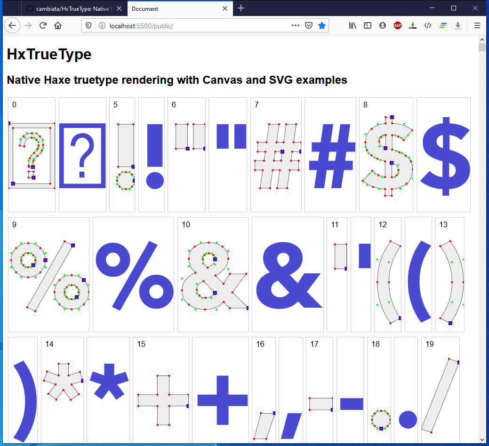

# HxTrueType
Native Haxe TrueType parsing and rendering. WIP.

### Based on 

- Jan Flanders's hxswfml library (https://code.google.com/archive/p/hxswfml/) wich seems to be unmaintained.
- Steve Hanov's blog article "Let's read a Truetype file from scratch" - http://stevehanov.ca/blog/?id=143
- George Corney's crosstarget typedarray implementation included in the Gluon lib: https://github.com/haxiomic/gluon

### What?
- Parses .ttf files and extracts glyph outline data, charactermap data (cmap), glyph metrics - not yet kerning data, but that's planned. Right now two implementations, one simpler [based on Steve Hanov's code](http://stevehanov.ca/blog/?id=143), where compound glyphs work, and one more complete based on Jan Flander's code where compound glyphs don't. The plan is to join these in a nice way... :-)
- Utils for rendering outline data to html [canvas](https://github.com/cambiata/HxTrueType/blob/master/src-truetype/truetype/TrueType2Canvas.hx) or [native svg](https://github.com/cambiata/HxTrueType/blob/master/src-truetype/truetype/TrueType2Svg.hx) (without html-dom dependencies). 
- Possible to save [extracted truetype data](https://github.com/cambiata/HxTrueType/blob/master/src-fonts/Fontdata_Arial.hx) as reusable Haxe typedef data, for easy use of font/glyphs without the parsing overhead.

## TODO
- Glyph metrics
- String metrics including kerning
